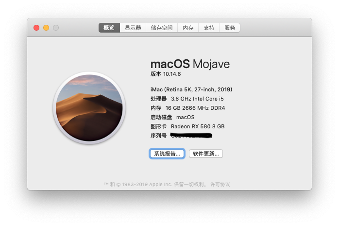
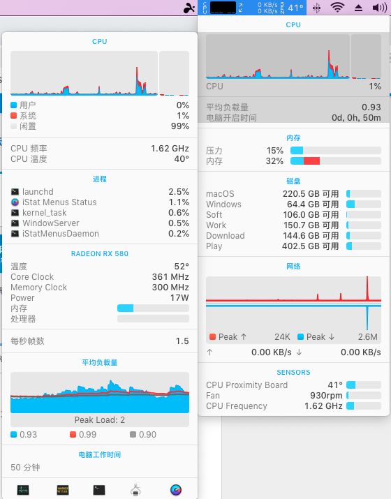
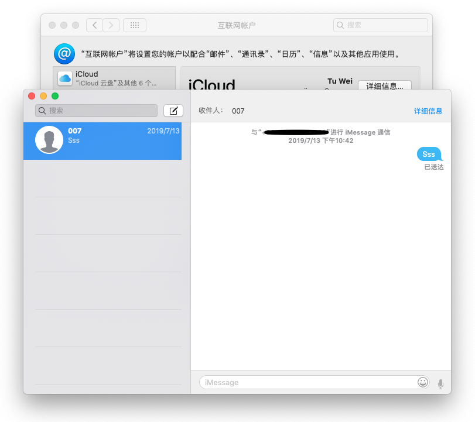
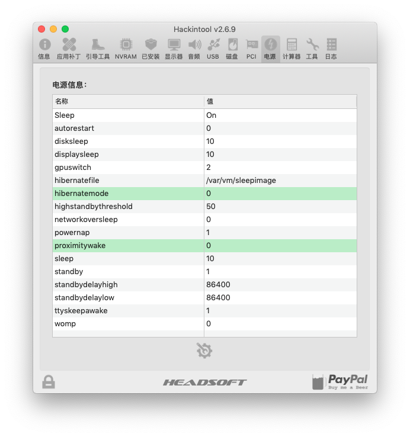
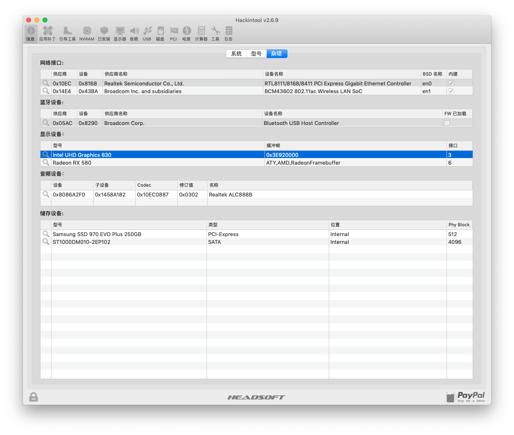
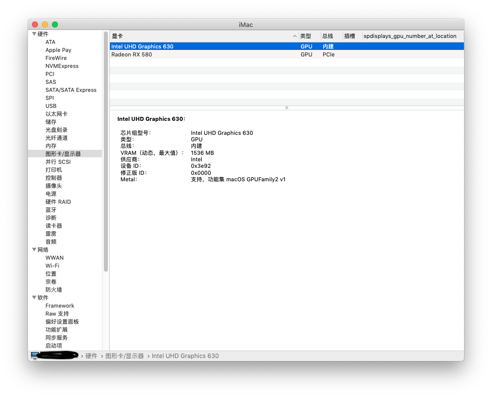
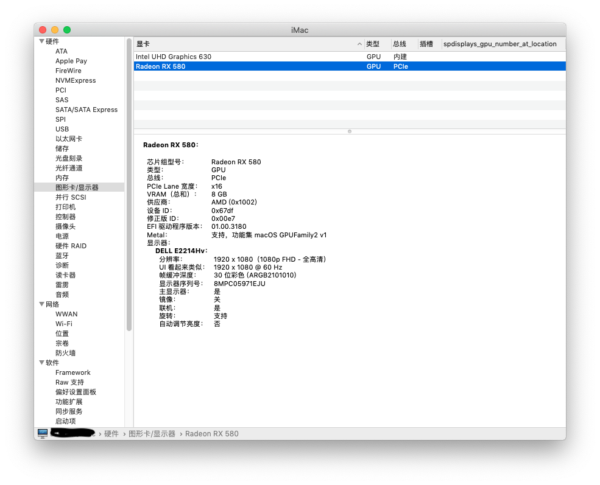
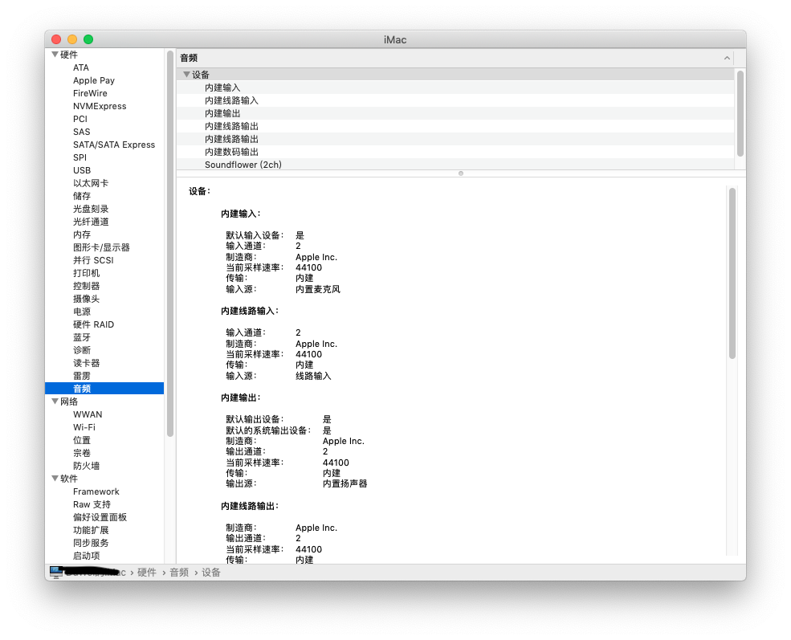
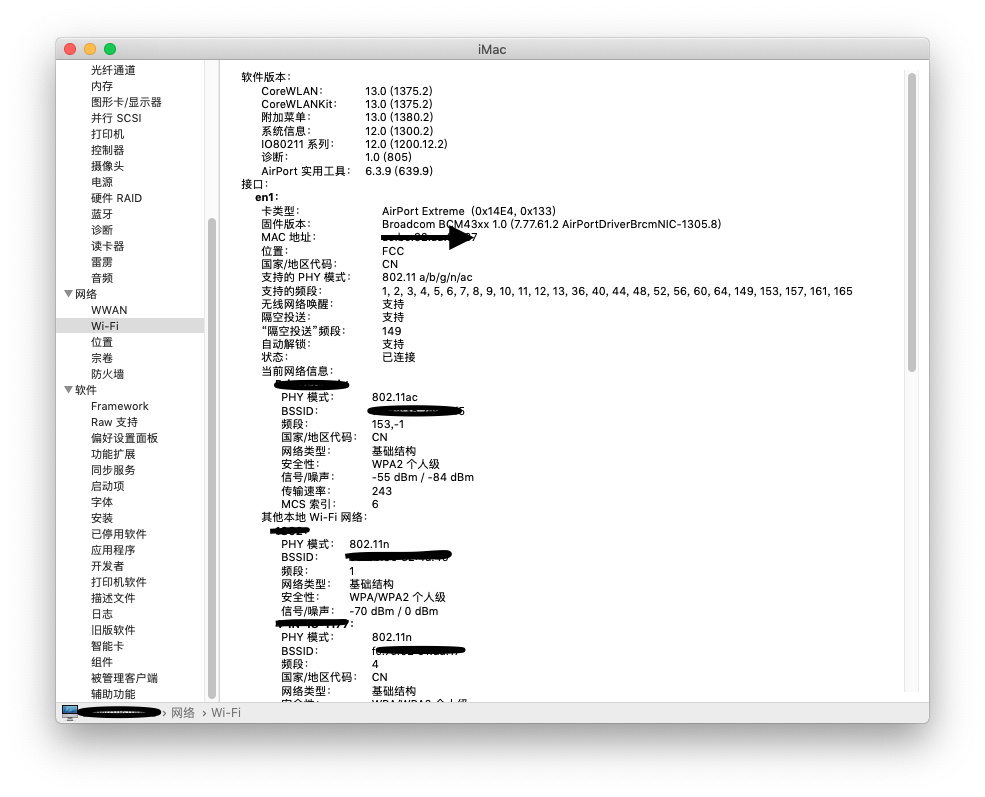
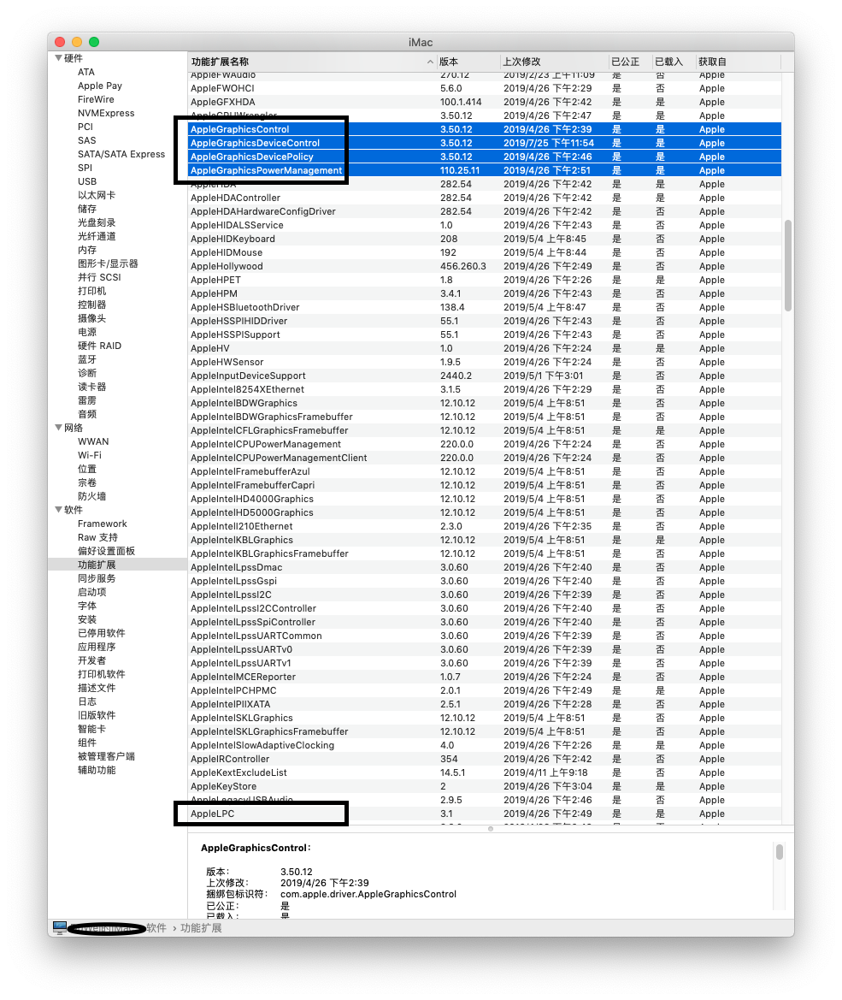

# 黑苹果 Hackintosh Z370P-D3 

### 功能:
-   Sleep: OK
-   双硬解: OK
-  iCloud: OK
-  Sensor: OK
- AirDrop: OK
- HandOff: OK
- USB Port: OK
- Bluetooth: OK

### 配置: 
- CPU:  i5-8600K 
-  MB:  技嘉Z370P-D3
- GPU:  DataLand 迪兰 RX580 (2304SP) + UHD630
- MEM:  十铨(Team) DELTA RGB系列 DDR4 3000 8G * 2
- HDD:  250GB 970EVO Plus + 1TB 希捷
- PSU:  Seasonic 海韵SSR-550
- WIFI: BCM943602CS 
- CASE: 航嘉 Huntkey GX580H

```bash
                                      ----------------------------------------------
                                      主板型号 : 
                 ###                  操作系统 : macOS Mojave 10.14.6 18G84
               ####                   内核版本 : Darwin 18.7.0
               ###                    开机时间 : 22 hours, 32 minutes
       #######    #######             Shell    : /bin/zsh
     ######################           当前时间 : 2019年 8月 2日 星期五 23时03分17秒 
    #####################             处理器   : Intel Core i5-8600K 3.60GHz x (6)
    ####################              内存     : 2348MB(Avai) / 16384MB(Total)
    ####################              磁盘     : 198GB(Avai) / 233GB(Total)
    #####################             IP 地址  : 公网 ;; connection timed out; no servers could be reached / 内网 192.168.99.161
     ######################           当前终端 : xterm-256color by Apple Terminal
      ####################            显卡设备 : Intel UHD Graphics 630 Radeon RX 580 / VRAM (Dynamic, Max): 1536 MB VRAM (Total): 8 GB
        ################              主显示器 : 1920 x 1080 (1080p FHD - Full High Definition)
         ####     #####               扩展显示 : 
```

### 注意项:
1. BIOS 设置参照 https://www.tonymacx86.com/threads/success-mojave-14-2-on-ga-z370p-d3-i5-8600k-intelhd630.268319/
2. 为了防止U盘在系统唤醒后提示意外弹出, 需要从bios里面禁用xmp, 将速度调节到最高2666MHz, 然后从clover里进行xmpdetection=yes
3. USB结合机箱的usb口使用Hackintool定制的, usbport 对应机型imac19,1
4. **为了修复偶尔的睡眠无法唤醒和完全使用`AptioMemoryFix-64.efi`, 需要禁用主板的`CFG Lock`, F5版本的BIOS中的CFG Lock偏移量为`0x585`, 具体设置方法参照 https://blog.xjn819.com/?p=317**

### ISSUE:
1. 电源设置里勾选"唤醒以供网络访问"后, 再次睡眠唤醒WIFI速度会降低
2. 屏保阿拉伯式花纹显示不正常(不知道是不是系统的问题)
3. 变频貌似只有三档, 不影响使用就没有继续鼓捣

### 截图:










